# Dev-Ops-11 Source Control & Modernized Delivery Automation Platform
# Dev-Ops-11: Source Control & Modernized Delivery Automation Platform

## Final Platform Architecture

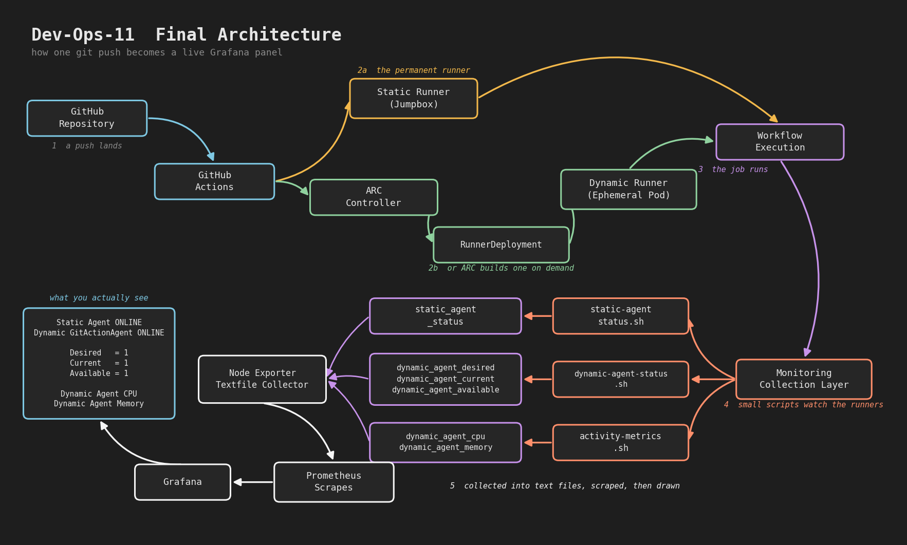

Dev-Ops-11 provides a complete source-control-driven delivery and observability architecture integrating GitHub Actions, static self-hosted runners, Kubernetes-hosted dynamic runners managed by Actions Runner Controller (ARC), custom telemetry collection, Prometheus, and Grafana.

A GitHub repository change triggers GitHub Actions workflows that execute through either a permanent static runner or an ephemeral Kubernetes-hosted dynamic runner. Operational telemetry is generated through custom monitoring scripts, exposed through Node Exporter's Textfile Collector, scraped by Prometheus, and visualized through Grafana dashboards.

The resulting operations dashboard provides visibility into:

- Static Agent Availability
- Dynamic GitActionAgent Availability
- Desired State
- Current State
- Available State
- CPU Activity
- Memory Activity

This architecture establishes the operational foundation for future GitOps and ArgoCD-based platform delivery workflows.

## Overview

The platform enables source-control-driven operations through both traditional self-hosted GitHub Actions runners and Kubernetes-hosted dynamic runners managed by Actions Runner Controller (ARC).

Repository events can trigger automated validation, infrastructure monitoring, workflow execution, and future deployment activities through a unified automation platform.

This project establishes the foundation for future CI/CD, observability, GitOps, and ArgoCD-based delivery workflows across the portfolio.

---
## Project Status

✅ COMPLETE

✅ SUCCESSFUL

✅ OBJECTIVES ACHIEVED

✅ EXCEEDED ORIGINAL SCOPE

## Executive Summary

The Source Control & Modernized Delivery Platform successfully evolved from a GitHub Actions validation effort into a complete delivery and observability platform.

The final solution integrates source control, GitHub Actions, static self-hosted runners, Kubernetes-hosted dynamic runners, Actions Runner Controller (ARC), Prometheus, Grafana, and custom operational telemetry.

The platform provides visibility into execution availability, desired-state health, runner capacity, and runtime activity while establishing the foundation for future GitOps and ArgoCD adoption.

## Portfolio Relationship

### Builds Upon

- Dev-Ops-10 Kubernetes Platform Engineering & Operations Platform
- Dev-Ops-10.5 CI/CD Platform Engineering & Operations Platform

### Future Integration

- Dev-Ops-11.5 GitOps & Platform Delivery Operations Platform
- Dev-Ops-12 AIOps & Multi-OS Operations Intelligence Platform

---

## Project Origin

As the platform portfolio expanded, a modern source-control-driven delivery solution was required to automate workflow execution and prepare for GitOps-based deployment strategies.

This project introduces GitHub-native automation while leveraging the existing Kubernetes platform to provide dynamic execution capacity for delivery workflows.

---

## Objectives

### Primary Objectives

- Implement GitHub Actions workflow automation
- Implement branch-based source control governance and validation workflows
- Integrate GitHub with Kubernetes
- Validate self-hosted GitHub Actions runner architectures
- Deploy Kubernetes-hosted dynamic GitHub runners
- Enable source-control-driven operations
- Validate end-to-end workflow execution
- Establish a monitoring foundation for platform observability
- Establish the foundation for future GitOps adoption

### Secondary Objectives

- Improve change traceability
- Standardize workflow execution
- Reduce dependency on static automation hosts
- Increase platform scalability
- Support future automated deployment workflows

---

## Environment

### Platform Type

Private Infrastructure Environment

### Core Components

- GitHub
- GitHub Actions
- Self-Hosted Runner
- Kubernetes Platform
- Actions Runner Controller (ARC)
- Cert-Manager
- Dynamic GitHub Runners

---

## Technology Stack

### Source Control

- Git
- GitHub
- GitHub Repositories
- Branch-Based Development
- Feature Branch Workflows

### Workflow Automation

- GitHub Actions
- Workflow Dispatch
- Self-Hosted GitHub Runners
- Dynamic GitHub Runners
- Actions Runner Controller (ARC)

### Platform Engineering

- Kubernetes
- Namespaces
- Deployments
- Pods
- RunnerDeployment
- Controllers
- Reconciliation Loops

### Identity & Access Management

- GitHub Apps
- Application Authentication
- Authorization Controls
- Repository Permissions
- Installation Tokens
- Kubernetes Secrets

### Certificate Management

- Cert-Manager
- Internal PKI
- Webhook Certificates
- TLS Certificate Lifecycle Management

### Infrastructure

- Linux
- Ubuntu
- SSH
- YAML

### CI/CD & Delivery

- Source-Control-Driven Operations
- Pipeline Automation
- Event-Driven Workflows
- Workflow Orchestration
- Dynamic Runner Execution
- Kubernetes-Based Job Execution

### Observability

- Prometheus
- Grafana
- Node Exporter
- Custom Prometheus Metrics
- Grafana Dashboards

### GitOps & Delivery (Future)

- Docker
- Container Registries
- ArgoCD
- GitOps
- Declarative Deployments

### Documentation & Architecture

- Markdown
- Draw.io
- GitHub Documentation

---

## Architecture

```text
Developer
    │
    ▼

Git Push
    │
    ▼

GitHub Repository
    │
    ▼

GitHub Actions
    │
    ▼

GitHub App
    │
    ▼

Actions Runner Controller (ARC)
    │
    ▼

RunnerDeployment
    │
    ▼

Dynamic GitHub Runner
    │
    ▼

Kubernetes Worker Node
    │
    ▼

Workflow Execution
```

---

## Current Status

### Monitoring Foundation

Validated monitoring capabilities include:

- Infrastructure health monitoring
- Certificate discovery workflows
- Static GitHub Actions agent monitoring
- Configuration-driven monitoring
- GitHub Actions monitoring execution
- ARC-based monitoring execution
- Monitoring source-of-truth architecture

These capabilities establish the foundation for future Grafana dashboards, operational visibility, and Security Action Center development.

### Completed

- Repository established
- Branch-based development workflow established
- GitHub Actions integrated
- Static self-hosted runner architecture validated
- SSH-based Kubernetes administration workflow validated
- GitHub App authentication implemented
- Certificate management platform implemented
- Actions Runner Controller (ARC) deployed
- Dynamic GitHub runner architecture validated
- Infrastructure monitoring foundation established
- Certificate discovery foundation established
- Monitoring architecture implemented
- End-to-end workflow execution validated

### In Progress

- None

Dashboard Version 1, monitoring architecture, static runner monitoring, dynamic runner monitoring, and ARC observability have been completed and validated.

### Planned

- GitOps workflows
- ArgoCD integration
- Application delivery observability
- Platform Operations Dashboard expansion
- Jenkins integration
- Security Action Center
- AIOps operational intelligence

---

## Runner Strategy

### Static Runner Model

The platform initially validated GitHub Actions using a self-hosted runner operating from the jumpbox platform.

#### Capabilities Validated

- GitHub Actions workflow execution
- Repository integration and authentication
- Branch-based workflow validation
- Kubernetes discovery operations
- Remote Kubernetes administration
- SSH-based automation workflows
- End-to-end GitHub Actions validation

#### Architecture

```text
GitHub
    │
    ▼

Static Runner
(Jumpbox)

    │
    ▼

SSH

    │
    ▼

Kubernetes Control Plane

    │
    ▼

kubectl

    │
    ▼

Cluster Operations
```

#### Benefits

- Simple architecture
- Persistent execution host
- Always available
- Centralized administration
- Easy troubleshooting

### Dynamic Runner Model

The platform was subsequently extended using Actions Runner Controller (ARC) deployed on Kubernetes.

#### Capabilities Validated

- Dynamic runner provisioning
- Automated runner registration
- GitHub App authentication
- Kubernetes-native execution
- Ephemeral workload execution
- Automated lifecycle management
- Scalable workflow capacity

#### Architecture

```text
GitHub
    │
    ▼

GitHub App

    │
    ▼

ARC Controller

    │
    ▼

RunnerDeployment

    │
    ▼

Dynamic Runner

    │
    ▼

Workflow Execution
```

#### Benefits

- Ephemeral execution
- Clean execution environment
- Kubernetes-native operation
- Automated runner lifecycle
- Reduced maintenance overhead

### Architectural Outcome

The platform successfully validated both static and dynamic GitHub Actions execution models.

#### Static Runners

- Jumpbox hosted
- Persistent
- Administrative workflow execution
- SSH-enabled Kubernetes operations

#### Dynamic Runners

- Kubernetes hosted
- Ephemeral
- Automatically provisioned
- Scalable workflow execution

This architecture provides operational flexibility while establishing a migration path toward fully containerized workflow execution.

---

## Validation

## Screenshots

### 01 - GitHub Repository Overview

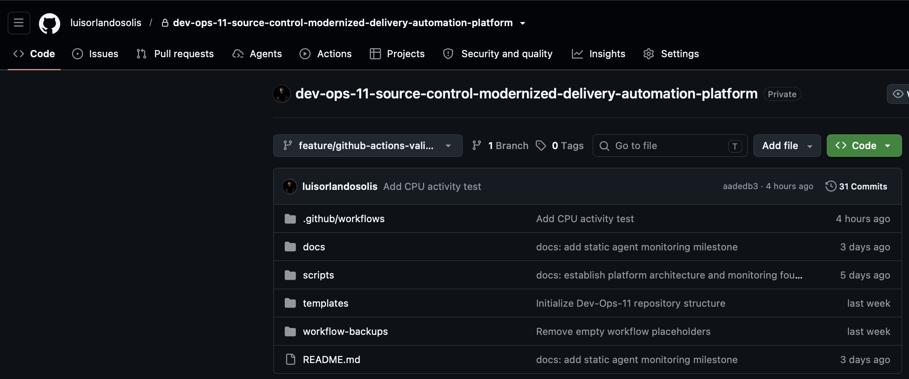

GitHub repository structure and initial project configuration.

### 02 - GitHub Actions Runs

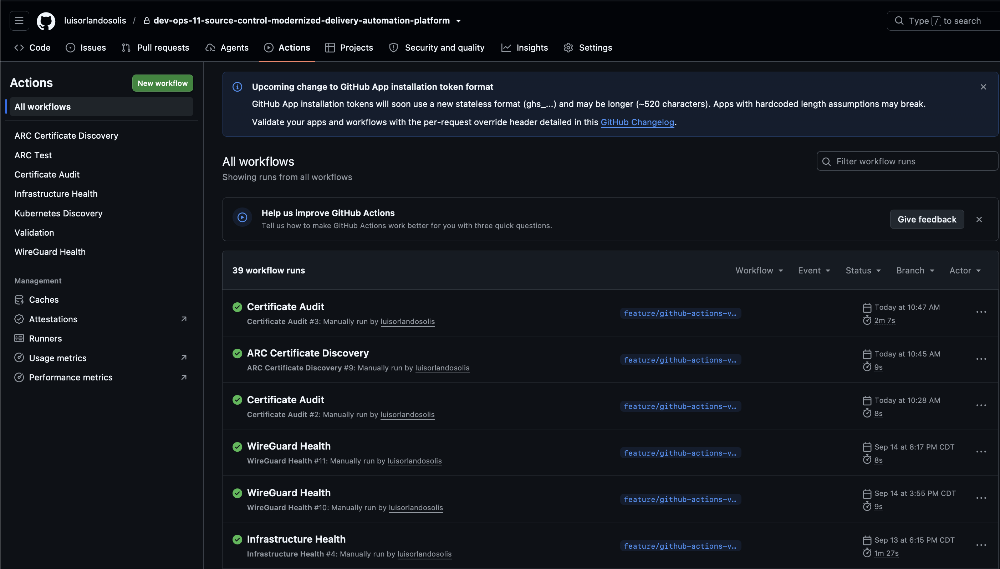

GitHub Actions workflow execution history showing successful pipeline runs.

### 03 - GitHub Actions Workflow Validation Success

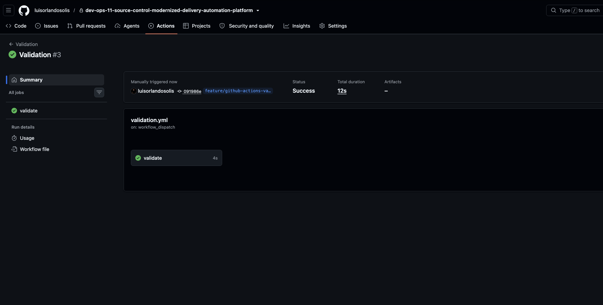

Validation of successful GitHub Actions workflow execution.

### 04 - GitHub Actions Dynamic Runner Success

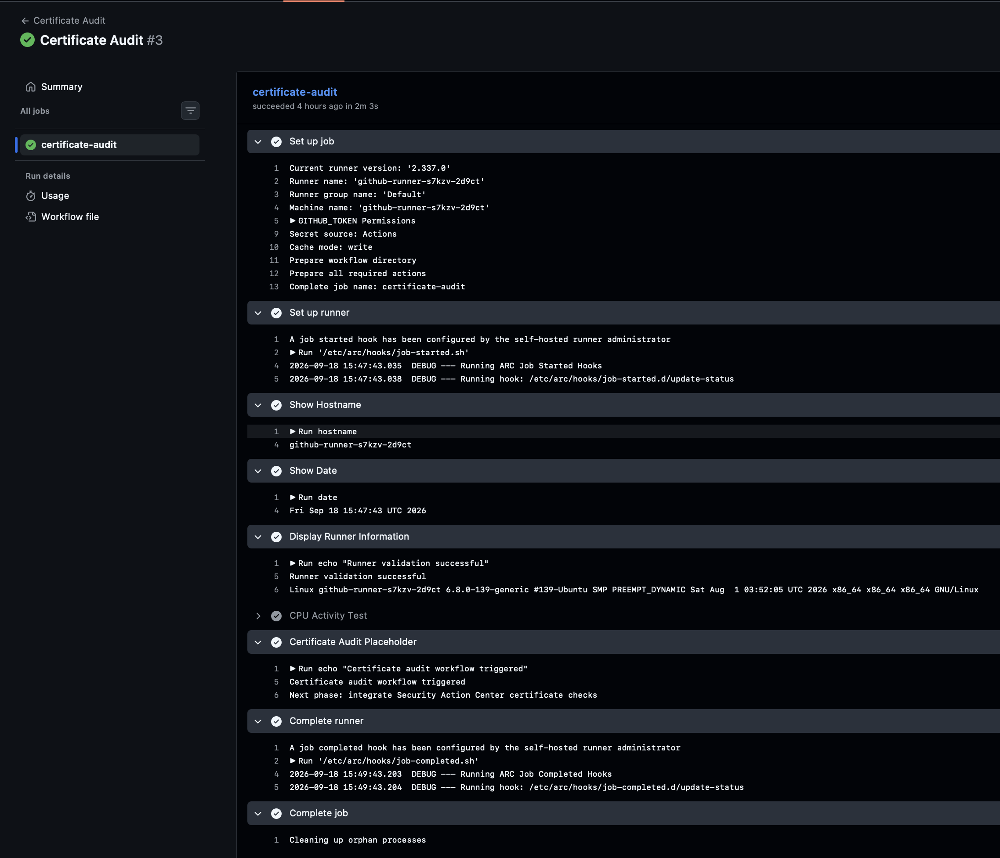

Dynamic ARC runner successfully executing GitHub Actions workloads.

### 05 - ARC RunnerDeployment Validation

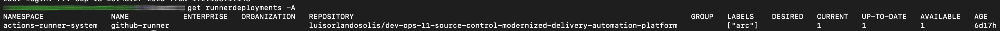

Validation of ARC RunnerDeployment resources within Kubernetes.

### 06 - Static Runner Validation

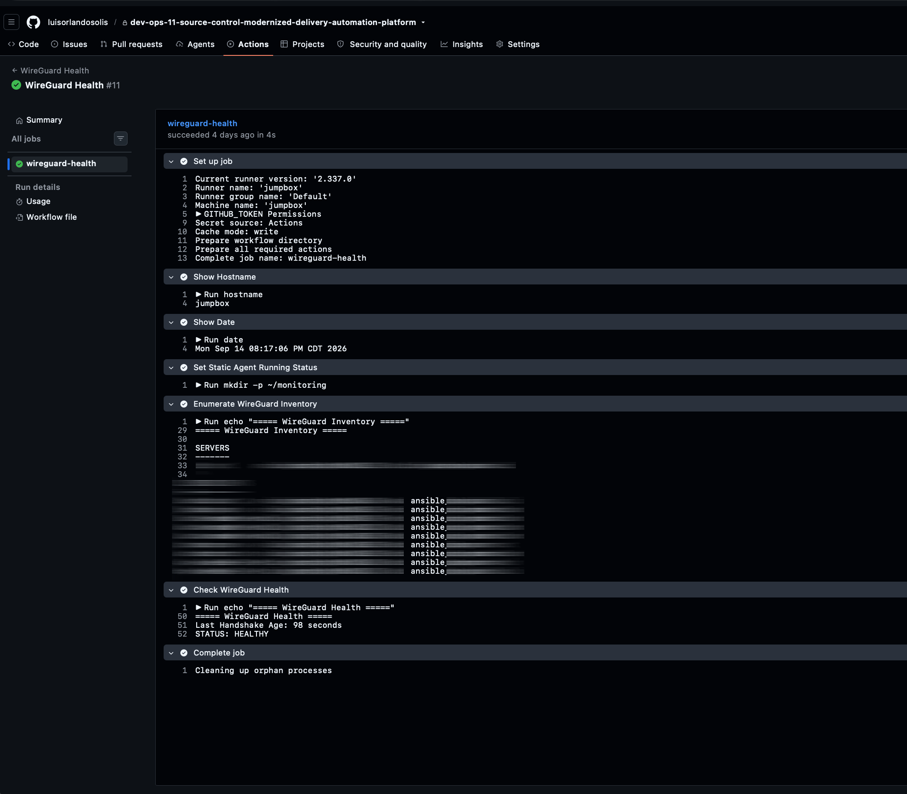

Validation of a self-hosted static GitHub Actions runner.

### 07 - GitHub Actions Kubernetes Discovery

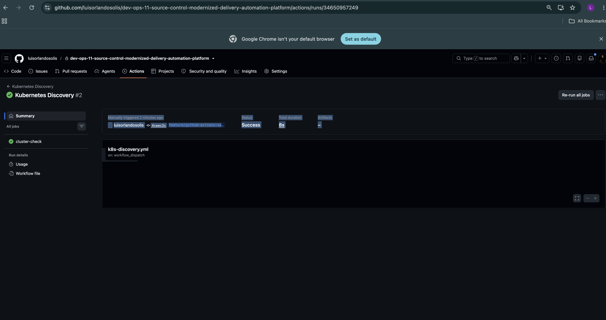

GitHub Actions workflow interacting with Kubernetes resources.

### 08 - Static Runner Registration and Execution

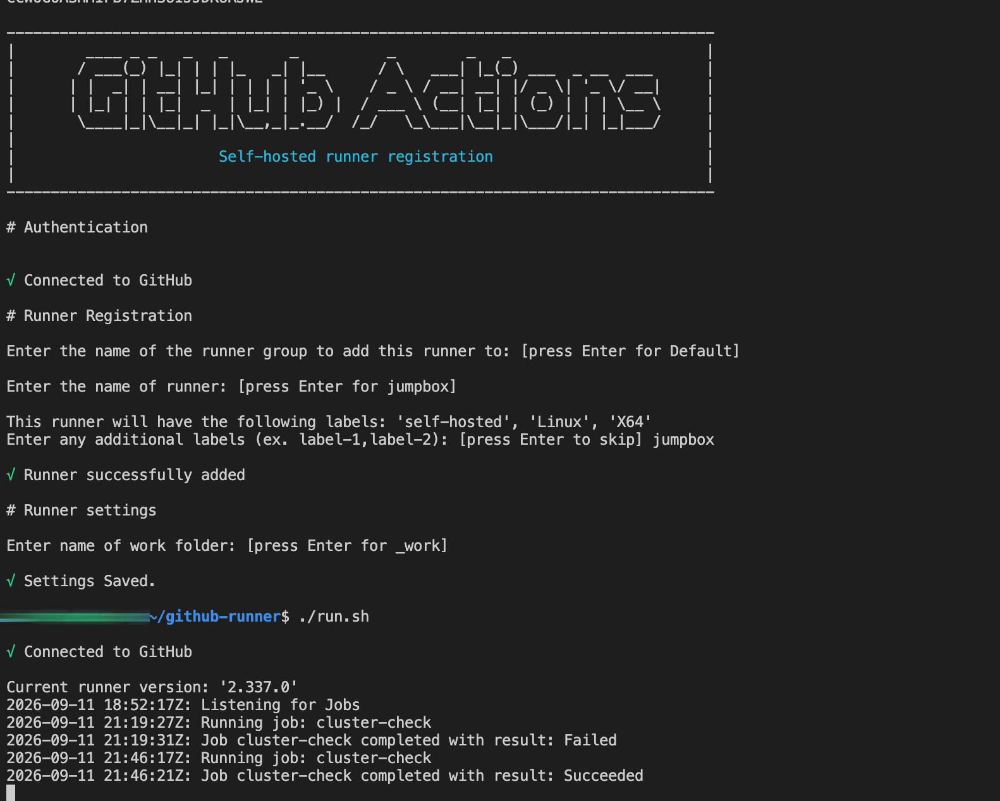

Successful registration and execution of workloads on a static runner.

### 09 - Dashboard v1 Overview

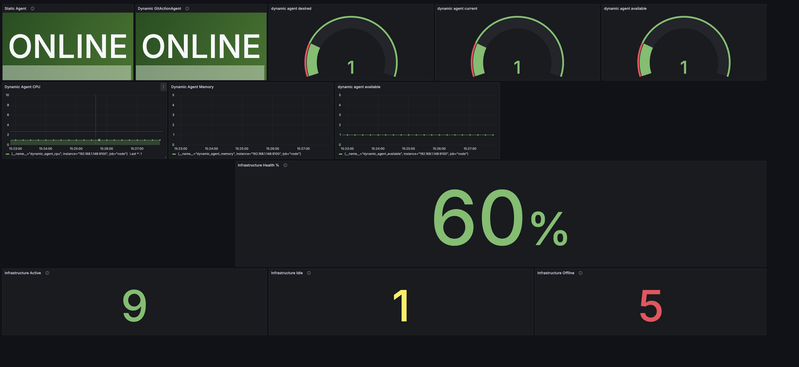

Platform monitoring dashboard displaying runner and platform visibility.

### 10 - ARC Pods Running

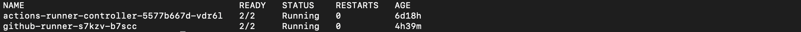

ARC controller and runner pods operating successfully within Kubernetes.

### Monitoring Validation

✅ Infrastructure health monitoring

✅ Monitoring workflow execution

✅ Dynamic runner monitoring execution

✅ Certificate discovery validation

✅ Monitoring architecture validation

✅ Configuration-driven monitoring workflows

### Source Control Validation

✅ Repository initialization

✅ Branch-based development workflow

✅ Feature branch validation

✅ Git push workflow execution

### GitHub Actions Validation

✅ Workflow creation

✅ Workflow execution

✅ Manual workflow dispatch

### Static Runner Validation

✅ Self-hosted runner registration

✅ Workflow execution from jumpbox

✅ SSH connectivity to Kubernetes control plane

✅ Kubernetes discovery operations

### Dynamic Runner Validation

✅ ARC deployment

✅ RunnerDeployment creation

✅ Dynamic runner registration

✅ Kubernetes scheduling

✅ Successful workflow execution

### End-to-End Platform Validation

The platform successfully validated both static and dynamic GitHub Actions execution models.

#### Static Runner Validation Path

```text
Git Push
    ↓
GitHub Actions
    ↓
Static Runner
    ↓
SSH
    ↓
Kubernetes Administration
```

#### Dynamic Runner Validation Path

```text
Git Push
    ↓
GitHub Actions
    ↓
GitHub App
    ↓
ARC Controller
    ↓
Dynamic Runner
    ↓
Kubernetes Execution
    ↓
Successful Job Completion
```

Result:

✅ Successful

---

## Key Outcomes

### Source Control Modernization

- Branch-based development workflow implemented
- Source-control-driven automation established
- GitHub workflow execution validated
- Controlled change validation process implemented

### Dual Runner Architecture

- Static self-hosted runner architecture validated
- Kubernetes-hosted dynamic runner architecture validated
- Operational flexibility established for multiple workflow execution models

### Kubernetes Integration

- GitHub Actions integrated with Kubernetes
- SSH-based Kubernetes administration validated
- Kubernetes-native workflow execution implemented
- Dynamic runner lifecycle management validated

### Identity & Security

- GitHub App authentication implemented
- Application-based authorization model established
- Certificate management platform deployed
- Secure credential integration validated

### Monitoring & Observability

- Infrastructure health monitoring implemented
- Certificate discovery workflows implemented
- Static GitHub Actions agent monitoring implemented
- Dynamic GitHub Actions agent monitoring implemented
- ARC desired-state monitoring implemented
- Activity telemetry monitoring implemented
- Configuration-driven monitoring architecture established
- Monitoring source-of-truth architecture implemented
- Grafana dashboard platform implemented

### Platform Engineering Outcomes

- Git Push to execution workflow validated
- Dynamic runner provisioning validated
- Controller-based automation architecture implemented
- Foundation established for future GitOps and ArgoCD integration

## Future Enhancements

### CI Platform Expansion

- Artifact generation
- Container image creation
- Container registry integration
- Multi-stage workflow automation

### Observability

- Advanced runner utilization analytics
- Workflow execution telemetry
- Historical performance trends
- Capacity planning metrics
- Operational alerting
- Security Action Center integration

### GitOps Delivery

- ArgoCD deployment automation
- Declarative Kubernetes delivery
- Desired-state reconciliation
- GitOps operational workflows

### Platform Operations

- Jenkins integration
- Unified Operations Dashboard
- Cross-platform delivery visibility
- Platform health scoring

### AIOps

- Event correlation
- Anomaly detection
- Automated remediation
- Operational recommendations

## Project Closure Summary

### Final Result

The project successfully evolved from a GitHub Actions validation effort into a complete delivery and observability platform.

Delivered capabilities include:

- Source-control-driven automation
- Static GitHub Actions execution
- Dynamic Kubernetes-hosted GitHub Actions execution
- GitHub App authentication
- Cert-Manager integration
- Actions Runner Controller (ARC)
- Infrastructure monitoring
- Dynamic runner monitoring
- Desired-state monitoring
- Runtime activity monitoring
- Prometheus integration
- Grafana operations dashboards

### Final Assessment

✅ COMPLETE

✅ SUCCESSFUL

✅ OBJECTIVES ACHIEVED

✅ EXCEEDED ORIGINAL SCOPE
